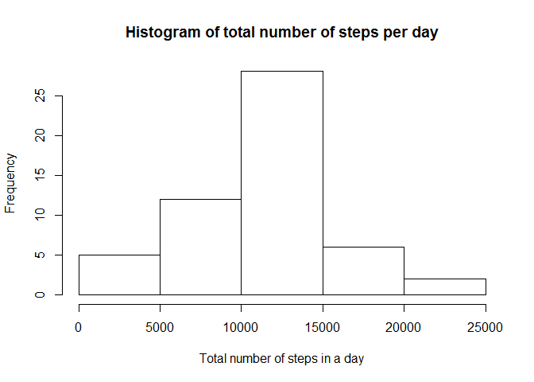

# Reproducible Research: Peer Assessment 1

This assignment will be described in multiple parts. You will need to write a report that answers the questions detailed below. Ultimately, you will need to complete the entire assignment in a single R markdown document that can be processed by knitr and be transformed into an HTML file.

Throughout your report make sure you always include the code that you used to generate the output you present. When writing code chunks in the R markdown document, always use echo = TRUE so that someone else will be able to read the code. This assignment will be evaluated via peer assessment so it is essential that your peer evaluators be able to review the code for your analysis.

For the plotting aspects of this assignment, feel free to use any plotting system in R (i.e., base, lattice, ggplot2)

Fork/clone the GitHub repository created for this assignment. You will submit this assignment by pushing your completed files into your forked repository on GitHub. The assignment submission will consist of the URL to your GitHub repository and the SHA-1 commit ID for your repository state.

NOTE: The GitHub repository also contains the dataset for the assignment so you do not have to download the data separately.

##Loading and preprocessing the data

Show any code that is needed to

1. Load the data (i.e. read.csv())
2. Process/transform the data (if necessary) into a format suitable for your analysis


```r
## load the packages used
library(knitr)
library(dplyr)
```

```
## Warning: package 'dplyr' was built under R version 3.2.2
```

```
## 
## Attaching package: 'dplyr'
```

```
## The following objects are masked from 'package:stats':
## 
##     filter, lag
```

```
## The following objects are masked from 'package:base':
## 
##     intersect, setdiff, setequal, union
```

```r
library(ggplot2)
```

```
## Warning: package 'ggplot2' was built under R version 3.2.2
```

```r
##1. Load the data (i.e. read.csv())
 
setwd ('/Users/javier/Data Science Specialization/Reproducible Research')
data<-read.csv('activity.csv')
head(data)
```

```
##   steps       date interval
## 1    NA 2012-10-01        0
## 2    NA 2012-10-01        5
## 3    NA 2012-10-01       10
## 4    NA 2012-10-01       15
## 5    NA 2012-10-01       20
## 6    NA 2012-10-01       25
```

##What is mean total number of steps taken per day?

For this part of the assignment, you can ignore the missing values in the dataset.

1. Calculate the total number of steps taken per day

2. If you do not understand the difference between a histogram and a barplot, research the difference between them. Make a histogram of the total number of steps taken each day

3. Calculate and report the mean and median of the total number of steps taken per day


```r
## ignore the missing values in the dataset.

data2<-na.omit(data)

## 1. Calculate the total number of steps taken per day
data_sum <- aggregate(steps ~ date, data2, sum)
head(data_sum)
```

```
##         date steps
## 1 2012-10-02   126
## 2 2012-10-03 11352
## 3 2012-10-04 12116
## 4 2012-10-05 13294
## 5 2012-10-06 15420
## 6 2012-10-07 11015
```

```r
## 2. Make a histogram of the total number of steps taken each day
hist(data_sum$steps, main="Histogram of total number of steps per day", 
     xlab="Total number of steps in a day", ylab="Frequency")
```

<!-- -->

```r
##create a png file and close de device creator 
dev.copy(png,'Hist1.png',  width = 800, height = 800)
```

```
## png 
##   3
```

```r
dev.off()
```

```
## png 
##   2
```

```r
## 3. Calculate and report the mean and median of the total number of steps taken per day

media1 <- round(mean(data_sum$steps))
mediana <- median(data_sum$steps)
```

###*The value of the mean is 1.0766\times 10^{4} and the median is 10765*


##What is the average daily activity pattern?

1. Make a time series plot (i.e. type = "l") of the 5-minute interval (x-axis) and the average number of steps taken, averaged across all days (y-axis)
2. Which 5-minute interval, on average across all the days in the dataset, contains the maximum number of steps?


```r
##data summary interval of steps
data_interval<- aggregate(steps ~ interval, data2, mean)
head(data_interval)
```

```
##   interval     steps
## 1        0 1.7169811
## 2        5 0.3396226
## 3       10 0.1320755
## 4       15 0.1509434
## 5       20 0.0754717
## 6       25 2.0943396
```

```r
## 1. Make a time series plot (i.e. type = "l") of the 5-minute interval (x-axis) and the average number of steps taken, averaged across all days (y-axis)

plot(data_interval$interval,data_interval$steps,type="l",main="Average number of steps averaged over all days", xlab="Interval", ylab="Average number of steps")
```

<!-- -->

```r
##create a png file and close de device creator 
dev.copy(png,'TSPlot1.png',  width = 800, height = 800)
```

```
## png 
##   3
```

```r
dev.off()
```

```
## png 
##   2
```

```r
## 2. Which 5-minute interval, on average across all the days in the dataset, contains the maximum number of steps?

# first i find row with max of steps
max_steps_row <- which.max(data_interval$steps)

# finally i find interval with this max
fila <- data_interval[max_steps_row, ]$interval
pasos <- round(data_interval[max_steps_row, ]$steps)
```
###*Resp: the interval with maximun number of steps is in the row 835 and has 206 steps*


##Imputing missing values

Note that there are a number of days/intervals where there are missing values (coded as NA). The presence of missing days may introduce bias into some calculations or summaries of the data.

1. Calculate and report the total number of missing values in the dataset (i.e. the total number of rows with NAs)
2. Devise a strategy for filling in all of the missing values in the dataset. The strategy does not need to be sophisticated. For example, you could use the mean/median for that day, or the mean for that 5-minute interval, etc.
3. Create a new dataset that is equal to the original dataset but with the missing data filled in.
4. Make a histogram of the total number of steps taken each day and Calculate and report the mean and median total number of steps taken per day. Do these values differ from the estimates from the first part of the assignment? What is the impact of imputing missing data on the estimates of the total daily number of steps?


```r
## 1. Calculate and report the total number of missing values in the dataset (i.e. the total number of rows with NAs)

sum(is.na(data))
```

```
## [1] 2304
```

```r
##2. Devise a strategy for filling in all of the missing values in the dataset. The strategy does not need to be sophisticated. For example, you could use the mean/median for that day, or the mean for that 5-minute interval, etc.
## 3. Create a new dataset that is equal to the original dataset but with the missing data filled in.

data_imputed <- data

for (i in 1:nrow(data_imputed)) {
    if (is.na(data_imputed$steps[i])) {
        interval_value <- data_imputed$interval[i]
        steps_value <- data_interval[
            data_interval$interval == interval_value,]
        data_imputed$steps[i] <- steps_value$steps
    }
}

## 4. Make a histogram of the total number of steps taken each day and Calculate and report the mean and median total number of steps taken per day. Do these values differ from the estimates from the first part of the assignment? What is the impact of imputing missing data on the estimates of the total daily number of steps?

# first i get the total number of steps taken each day
data_imputed_steps_day <- aggregate(steps ~ date, data_imputed, sum)
head(data_imputed_steps_day)
```

```
##         date    steps
## 1 2012-10-01 10766.19
## 2 2012-10-02   126.00
## 3 2012-10-03 11352.00
## 4 2012-10-04 12116.00
## 5 2012-10-05 13294.00
## 6 2012-10-06 15420.00
```

```r
# plot the histogram
hist(data_imputed_steps_day$steps, main="Histogram of total number of steps per day (imputed)", 
     xlab="Total number of steps in a day")
```

<!-- -->

```r
##create a png file and close de device creator 
dev.copy(png,'Hist2.png',  width = 800, height = 800)
```

```
## png 
##   3
```

```r
dev.off()
```

```
## png 
##   2
```

```r
# i get mean and median of imputed data
mean(data_imputed_steps_day$steps)
```

```
## [1] 10766.19
```

```r
median(data_imputed_steps_day$steps)
```

```
## [1] 10766.19
```

```r
# i get mean and median of data without NA's
mean(data_sum$steps)
```

```
## [1] 10766.19
```

```r
median(data_sum$steps)
```

```
## [1] 10765
```
### *Resp: only the median had a little difference after the imputation*


##Are there differences in activity patterns between weekdays and weekends?

For this part the weekdays() function may be of some help here. Use the dataset with the filled-in missing values for this part.

1. Create a new factor variable in the dataset with two levels - "weekday" and "weekend" indicating whether a given date is a weekday or weekend day.
2. Make a panel plot containing a time series plot (i.e. type = "l") of the 5-minute interval (x-axis) and the average number of steps taken, averaged across all weekday days or weekend days (y-axis). See the README file in the GitHub repository to see an example of what this plot should look like using simulated data.


```r
data_imputed['Week_day'] <- weekdays(as.Date(data_imputed$date))
data_imputed$Week_day[data_imputed$Week_day  %in% c('sabado','domingo') ] <- "weekend"
data_imputed$Week_day[data_imputed$Week_day != "weekend"] <- "weekday"


# convert type_of_day from character to factor
data_imputed$Week_day <- as.factor(data_imputed$Week_day)

# calculate average steps by interval across all days
data_imputed_steps_interval <- aggregate(steps ~ interval + Week_day, data_imputed, mean)

# creat a plot
qplot(interval, 
      steps, 
      data = data_imputed_steps_interval, 
      type = 'l', 
      geom=c("line"),
      xlab = "Interval", 
      ylab = "Number of steps", 
      main = "Activity patterns in weekdays and weekends") +
    facet_wrap(~ Week_day, ncol = 1)
```

<!-- -->

```r
##create a png file and close de device creator 
dev.copy(png,'TSPlot2.png',  width = 800, height = 800)
```

```
## png 
##   3
```

```r
dev.off()
```

```
## png 
##   2
```
### *Resp: there are slighty differences between the behavior in weekdays and weekend days*
